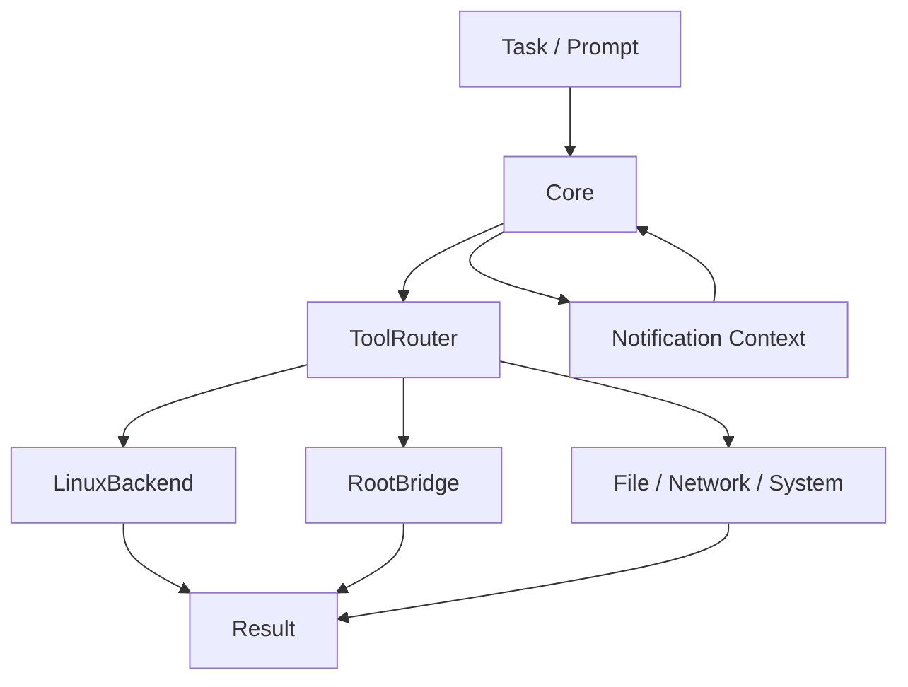

# Codex Android: Core + ToolRouter + Notification Pipeline

Дата подготовки: 2026-06-10

Этот документ фиксирует проделанную работу по переводу `codex-android-RU` от разрозненных shell-обходов к более строгой архитектуре:

- `Core` как источник фактов и вход задач
- `ToolRouter` как диспетчер маршрутизации
- `ExecutionTarget` как слой исполнения
- `LinuxBackend` как узкий Linux runtime
- `RootBridge` как узкий Android privileged bridge
- уведомления как реальный источник сигналов для автоматизации

Документ написан как долговременная память проекта. Он не заменяет код, но позволяет быстро восстановить архитектурный замысел, границы ответственности и список добавленных инструментов.

## 1. Что было не так изначально

Изначальная проблема была не в самой модели Codex CLI, а в среде выполнения:

- `Codex` на телефоне имел недостаточно строгий слой диспетчеризации
- shell-логика размазывалась по разным местам
- `proot` давал Linux userspace, но не давал стабильной модели для системных операций Android
- `root` и `Linux runtime` были смешаны в восприятии, хотя это разные уровни
- отсутствовал отдельный `Core`, который мог бы собирать факты об устройстве и помогать маршрутизации

Главный вывод:

- `Codex exec` должен жить в Linux runtime
- Android root-операции должны идти через отдельный `RootBridge`
- системные факты, особенно уведомления, должны попадать в `Core`
- `ToolRouter` должен выбирать путь, а не выполнять всю логику сам

## 2. Итоговая архитектурная схема

Сейчас схема выглядит так:



Смысл схемы:

- `Core` знает, что реально происходит на устройстве
- `ToolRouter` знает, куда отправить задачу
- `ExecutionTarget` знает, как именно выполнить
- `Provider/surface` только принимает вход и отдаёт результат

Это похоже на то, что полезно брать из аналогичных решений:

- Core знает, что происходит
- ToolRouter знает, куда отправить
- ExecutionTarget знает, как выполнить
- Provider/surface просто даёт вход и вывод

## 3. Что именно было добавлено

### 3.1. `ToolRouter`

Файл:

- `C:\AFD-MCP\codex-android-RU\app\src\main\java\com\codex\android\bridge\ToolRouter.kt`

Что добавлено:

- `ExecutionTarget`
  - `LINUX`
  - `ROOT`
  - `FILE`
  - `NETWORK`
  - `SYSTEM`
- `ToolCategory`
  - `LINUX`
  - `ROOT`
  - `FILE`
  - `NETWORK`
  - `SYSTEM`
  - `NOTIFICATION`
  - `UNKNOWN`
- `ToolSpec`
- `ToolSuggestion`
- `RoutingDecision`

### 3.2. Каталог стандартных инструментов

Добавлен явный набор стандартных инструментов:

- `linux_run`
- `linux_run_script`
- `linux_write_file`
- `linux_read_file`
- `root_run`
- `root_read`
- `root_write`
- `system_getprop`
- `system_pm`
- `system_am`
- `iptables_dump`
- `iptables_apply`
- `notify`
- `toast`
- `notifications_list`
- `notifications_analyze`

Это важно, потому что теперь у маршрутизатора есть не только логика выбора, но и формализованный каталог возможностей.

### 3.3. `analyzePrompt(...)`

Теперь `ToolRouter` делает не только “угадай инструмент”, а возвращает полноценное решение:

- какой инструмент использовать
- почему он выбран
- какие сигналы привели к выбору
- какой следующий шаг
- при каком условии надо перейти дальше
- нужна ли подтверждающая безопасность

Пример смысла `RoutingDecision`:

- `toolId`: `notifications_list`
- `category`: `NOTIFICATION`
- `confidence`: `92`
- `reason`: `Prompt refers to recent device state and notification history is available`
- `signals`: `["prompt mentions notifications", "recent notification cache available"]`
- `nextStep`: `List recent system notifications ...`
- `transitionCondition`: `If the notifications do not contain the needed event ...`

## 4. Почему появился `Core`

`Core` добавлен, потому что одной маршрутизации недостаточно. Нужен слой, который:

- собирает уведомления
- хранит recent notification state
- строит контекст из события устройства
- умеет принимать задачу и возвращать структурированный план
- подготавливает информацию для `ToolRouter`

Файл:

- `C:\AFD-MCP\codex-android-RU\app\src\main\java\com\codex\android\core\CodexCoreModule.kt`

### 4.1. Что хранит Core

`Core` хранит:

- `NotificationRecord`
- `NotificationActionRecord`
- `NotificationAnalysis`
- `CoreRoutingSignal`
- `CoreTaskPlan`

### 4.2. Что делает Core

Core умеет:

- принять событие уведомления
- извлечь из него текст, канал, категорию, actions
- сохранить последние события в cache
- построить текстовый notification context
- проанализировать последнее уведомление
- принять задачу через `submitTask(prompt)`
- вернуть `CoreTaskPlan`
- подготовить `buildTaskContext(prompt)`

### 4.3. Зачем Core нужен именно для автоматизации

Потому что автоматизация на телефоне не строится только на shell-командах. Она строится на фактах:

- что появилось на экране
- какое уведомление пришло
- есть ли action buttons
- какой app/source сгенерировал событие
- можно ли реагировать сразу

Именно это позволяет строить:

- mail-like сценарии
- response workflows
- notifications-based automation
- follow-up действия по system events

## 5. NotificationListenerService как источник фактов

Файл:

- `C:\AFD-MCP\codex-android-RU\app\src\main\java\com\ai\assistance\operit\services\notification\CodexNotificationListenerService.kt`

Сервис теперь:

- ловит `onNotificationPosted(...)`
- превращает notification в факт для Core
- не хранит архитектурную логику у себя

То есть сервис не “аналитик”, а сенсор.

Core уже решает, что с этим фактом делать.

## 6. `AnyclawManager` и новые builtin tools

Файл:

- `C:\AFD-MCP\codex-android-RU\app\src\main\java\com\codex\android\codex\AnyclawManager.kt`

### 6.1. Добавленные builtin packages

Добавлен пакет:

- `codex-core`

Инструменты:

- `submit`
- `analyze`
- `context`

Добавлена ветка:

- `android-notification`
  - `notify`
  - `toast`
  - `list`
  - `analyze`

### 6.2. Смысл

Теперь Core можно использовать как отдельный инструмент:

- отправить задачу
- получить analysis
- получить context

Это важно, потому что задача может идти:

- из UI
- из Codex bridge
- из Anyclaw tool surface

без привязки к одному каналу.

## 7. `CodexLocalExecBridge`

Файл:

- `C:\AFD-MCP\codex-android-RU\app\src\main\java\com\codex\android\bridge\CodexLocalExecBridge.kt`

### 7.1. Что изменено

Добавлено:

- вызов `toolRouter.analyzePrompt(prompt)`
- получение `routingHint`
- получение `routingDecision`
- встраивание Core-контекста в prompt
- логирование маршрута

### 7.2. Что попадает в prompt

Перед `codex exec` теперь подмешивается:

- routing hint
- routing analysis
- Core task context
- notification context

Это важно, потому что модель теперь видит не только текст пользователя, но и структуру того, что Core уже выяснил про устройство.

## 8. RootBridge и LinuxBackend

### 8.1. LinuxBackend

`LinuxBackend` используется для:

- `codex exec`
- bash
- git
- python
- scripts
- workspace operations

Это правильное место для полноценного Linux userspace.

### 8.2. RootBridge

`RootBridge` используется для:

- host root command execution
- `iptables`
- `pm`
- `am`
- `getprop`
- file/system operations on Android host

`RootBridge` не должен становиться местом архитектурного решения. Он должен быть узким executor-слоем.

## 9. Что было сделано по `super_admin.js`

Файл:

- `C:\AFD-MCP\codex-android-RU\app\src\main\assets\packages\super_admin.js`

Смысл изменения:

- `root_run` оставлен как явный доменный вход
- `shell` остался как compatibility alias
- вызов root bridge вынесен в отдельный helper

Это полезно, потому что:

- не смешивает `terminal` и `root`
- сохраняет обратную совместимость
- делает split между Linux runtime и Android root bridge видимым

## 10. Как теперь работает поток

### 10.1. При обычном запросе

1. Пользователь отправляет prompt
2. `CodexLocalExecBridge` передаёт prompt в `ToolRouter.analyzePrompt(...)`
3. `ToolRouter` обращается к `Core`
4. `Core` смотрит на notification state
5. `Core` возвращает `CoreTaskPlan`
6. `ToolRouter` формирует `RoutingDecision`
7. `CodexLocalExecBridge` добавляет `Core task context` в prompt
8. `codex exec` выполняется в Linux runtime

### 10.2. При notification-driven задаче

1. NotificationListener ловит событие
2. Core сохраняет notification record
3. Task / prompt приходит в Core
4. Core видит actionable notification
5. Core предлагает `notifications_list` или `notifications_analyze`
6. `ToolRouter` маршрутизирует к notification tool
7. Tool возвращает структурированный факт
8. Следующий шаг выбирается уже на основе результата

## 11. Почему это лучше, чем просто shell

Потому что shell сам по себе:

- не знает смысл задачи
- не хранит состояние device events
- не умеет “понимать” действия уведомления
- не различает факты и догадки

А Core + Router схема:

- хранит факты
- выделяет сигналы
- выбирает путь
- позволяет строить tool loop

## 12. Текущие ключевые файлы

### Core

- `C:\AFD-MCP\codex-android-RU\app\src\main\java\com\codex\android\core\CodexCoreModule.kt`

### Notification listener

- `C:\AFD-MCP\codex-android-RU\app\src\main\java\com\ai\assistance\operit\services\notification\CodexNotificationListenerService.kt`

### Router

- `C:\AFD-MCP\codex-android-RU\app\src\main\java\com\codex\android\bridge\ToolRouter.kt`

### Local execution bridge

- `C:\AFD-MCP\codex-android-RU\app\src\main\java\com\codex\android\bridge\CodexLocalExecBridge.kt`

### Tool surface

- `C:\AFD-MCP\codex-android-RU\app\src\main\java\com\codex\android\codex\AnyclawManager.kt`

### JS root shell surface

- `C:\AFD-MCP\codex-android-RU\app\src\main\assets\packages\super_admin.js`

## 13. Ключевые code excerpts

Ниже не весь код, а опорные фрагменты для восстановления логики.

### 13.1. Core task entry

```kotlin
fun submitTask(prompt: String, limit: Int = 5): CoreTaskPlan? {
    val text = prompt.trim()
    if (text.isBlank()) return null

    val notificationAnalysis = analyzeLatestNotification(limit)
    val notificationContext = buildNotificationContext(limit)
    val lower = text.lowercase()

    val notificationIntent = lower.contains("notification") ||
        lower.contains("уведом") ||
        lower.contains("mail") ||
        lower.contains("email") ||
        lower.contains("reply")

    if (!notificationIntent && notificationAnalysis == null) {
        return null
    }

    return CoreTaskPlan(
        taskSummary = text,
        recommendedToolId = ...,
        confidence = ...,
        reason = ...,
        signals = ...,
        nextStep = ...,
        transitionCondition = ...,
        notificationContext = notificationContext,
        notificationActionable = ...,
        notificationTopActions = ...
    )
}
```

### 13.2. Router taking route from Core

```kotlin
fun analyzePrompt(prompt: String): RoutingDecision? {
    val text = prompt.lowercase()
    CodexCoreModule.submitTask(prompt)?.let { taskPlan ->
        return RoutingDecision(
            toolId = taskPlan.recommendedToolId,
            category = ToolCategory.NOTIFICATION,
            executionTarget = null,
            confidence = taskPlan.confidence,
            reason = taskPlan.reason,
            signals = taskPlan.signals,
            nextStep = taskPlan.nextStep,
            transitionCondition = taskPlan.transitionCondition,
            requiresConfirmation = taskPlan.notificationActionable
        )
    }

    return when {
        // other heuristics
    }
}
```

### 13.3. Local bridge adding Core context

```kotlin
val routingDecision = toolRouter.analyzePrompt(prompt)
val coreContext = CodexCoreModule.buildTaskContext(prompt)
val effectivePrompt = buildConversationPrompt(
    chatId,
    prompt,
    routingHint,
    routingDecision,
    coreContext
)
```

### 13.4. Notification tool list/analyze

```kotlin
"list" -> {
    val limit = args["limit"]?.toIntOrNull()?.coerceIn(1, 50) ?: 10
    val notifications = CodexCoreModule.getRecentNotifications(limit)
    // JSON response
}

"analyze" -> {
    val limit = args["limit"]?.toIntOrNull()?.coerceIn(1, 10) ?: 5
    val analysis = CodexCoreModule.analyzeLatestNotification(limit)
    // JSON response
}
```

## 14. Что это даёт дальше

Теперь можно спокойно добавлять следующие домены без раздувания shell-логики:

- `mail`
- `browser`
- `calendar`
- `files`
- `system`
- `root`
- `notifications`

При этом:

- `Core` остаётся источником фактов
- `ToolRouter` остаётся диспетчером
- `ExecutionTarget` остаётся слоем исполнения

## 15. Проверка состояния

После всех изменений сборка Kotlin прошла успешно.

Это важно, потому что новая архитектура:

- не только описана
- но и реально интегрирована
- и не ломает проект

## 16. Резюме

Главная идея перехода:

- не давать Codex “просто shell”
- а дать ему:
  - Core, который понимает факты устройства
  - ToolRouter, который выбирает путь
  - ExecutionTarget, который исполняет

Для Android-автоматизации это гораздо правильнее, чем пытаться всё свести к одному root shell.

## 17. Примечание по сохранности

Этот документ создан как память о текущей архитектуре и может использоваться для восстановления:

- структуры модулей
- маршрутизации
- уведомлений как источника фактов
- задачи как входа в Core
- логики перехода от Core к ToolRouter и execution слоям

